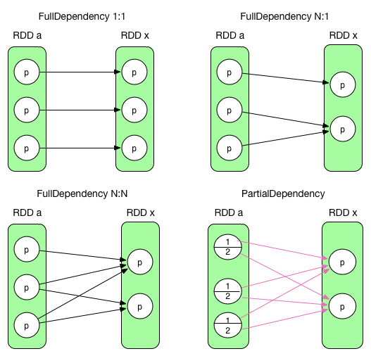
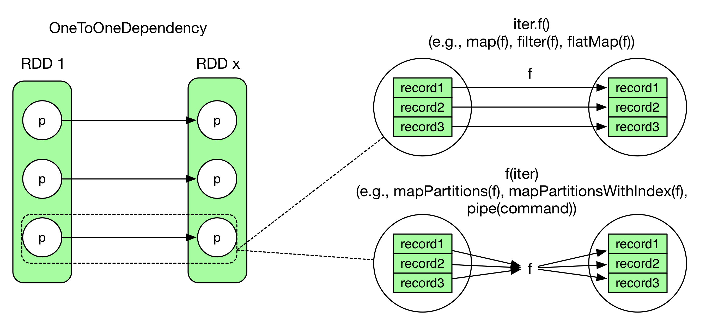
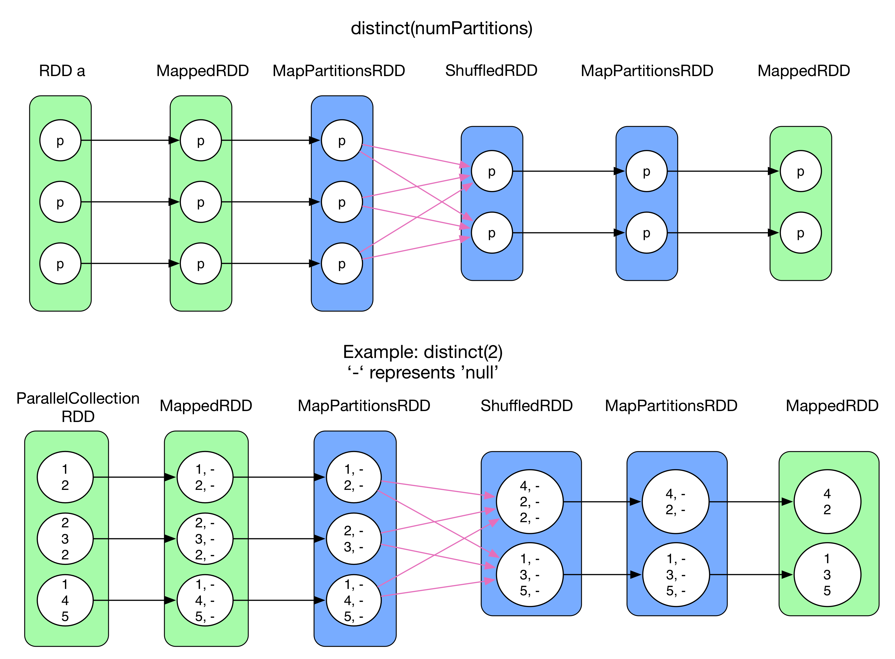
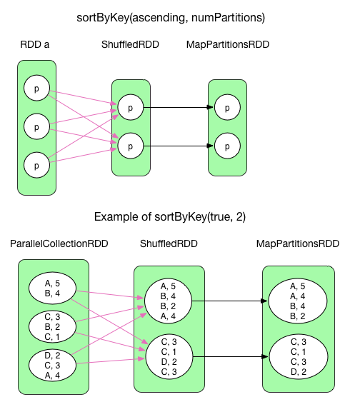

# Job Logical Plan

## ตัวย่างการสร้าง Logical plan


แผนภาพด้านบนอธิบายให้เห็นว่าขั้นตอนของแผนมีอยู่ 4 ขั้นตอนเพื่อให้ได้ผลลัพธ์สุดท้ายออกมา

1.	เริ่มต้นสร้าง `RDD` จากแหล่งไหนก็ได้.(in-memory data, ไฟล์บนเครื่อง, HDFS, HBase, etc). (ข้อควรทราบ `parallelize()` มีความหมายเดียวกับ `createRDD()` ที่เคยกล่าวถึงในบนที่แล้ว)

2.	ซีรีย์ของ *transformation operations* หรือการกระทำการแปลงบน `RDD` แสดงโดย `transformation()` แต่ละ `transformation()` จะสร้าง `RDD[T]` ตั้งแต่ 1 ตัวขึ้นไป โดยที่ `T` สามารถเป็นตัวแปรประเภทไหนของ Scala ก็ได้ (ถ้าเขียนใน Scala)

	>	ข้อควรทราบ สำหรับคู่ Key/Value ลักษณะ `RDD[(K, V)]` นั้นจะจัดการง่ายกว่าถ้า K เป็นตัวแปรประเภทพื้นฐาน เช่น `Int`, `Double`, `String` เป็นต้น แต่มันไม่สามารถทำได้ถ้ามันเป็นตัวแปรชนิด Collection เช่น `Array` หรือ `List` เพราะกำหนดการพาร์ทิชันได้ยากในขั้นตอนการสร้างพาร์ทิชันฟังก์ชันของตัวแปรที่เป็นพวก Collection
	
3.	*Action operation* แสดงโดย `action()` จะเรียกใช้ที่ `RDD` ตัวสุดท้าย จากนั้นในแต่ละพาร์ทิชันก็จะสร้างผลลัพธ์ออกมา

4.	ผลลัพธ์เหล่านี้จะถูกส่งไปที่ไดรว์เวอร์จากนั้น `f(List[Result])` จะคำนวณผลลัพธ์สุดท้ายที่จะถูกส่งกลับไปบอกไคลเอนท์ ตัวอย่างเช่น `count()` จะเกิด 2 ขั้นตอนคำ `action()` และ `sum()`

> RDD สามารถที่จะแคชและเก็บไว้ในหน่วยความจำหรือดิสก์โดยเรียกใช้ `cache()`, `persist()` หรือ `checkpoint()` จำนวนพาร์ทิชันโดยปกติถูกกำหนดโดยผู้ใช้ ความสัมพธ์ของการพาร์ทิชันระหว่าง 2 RDD ไม่สามารถเป็นแบบ 1 to 1 ได้ และในตัวอย่างด้านบเราจะเห็นว่าไม่ใช้แค่ความสัมพันธ์แบบ 1 to 1 แต่เป็น Many to Many ด้วย

## แผนเชิงตรรกะ Logical Plan

ตอนที่เขียนโค้ดของ Spark คุณก็จะต้องมีแผนภาพการขึ้นต่อกันอยู่ในหัวแล้ว (เหมือนตัวอย่างที่อยู่ข้างบน) แต่ไอ้แผนที่วางไว้มันจะเป็นจริงก็ต่อเมื่อ `RDD` ถูกทำงานจริง (มีคำสั่งmี่เป็นการกระทำ Action)		

เพื่อที่จะให้เข้าใจชัดเจนยิ่งขึ้นเราจะคุยกันในเรื่องของ		
-	จะสร้าง RDD ได้ยังไง ? RDD แบบไหนถึงจะประมวลผล ?		
-	จะสร้างความสัมพันธ์ของการขึ้นต่อกันของ RDD ได้อย่างไร ?		

###	1. จะสร้าง RDD ได้ยังไง ? RDD แบบไหนถึงจะประมวลผล ?

คำสั่งพวก `transformation()` โดยปกติจะคืนค่าเป็น `RDD` แต่เนื่องจาก `transformation()` นั้นมีการแปลงที่ซับซ้อนทำให้มี sub-`transformation()` หรือการแปลงย่อยๆเกิดขึ้นนั่นทำให้เกิด RDD หลายตัวขึ้นได้จึงเป็นเหตุผลที่ว่าทำไม RDD ถึงมีเยอะขึ้นได้ ซึ่งในความเป็นจริงแล้วมันเยอะมากกว่าที่เราคิดซะอีก		
Logical plan นั้นเป็นสิ่งจำเป็นสำหรับ *computing chain* ทุกๆ `RDD` จะมี `compute()` ซึ่งจะรับเรคอร์ดข้อมูลจาก `RDD` ก่อนหน้าหรือจากแหล่งข้อมูลมา จากนั้นจะแปลงตาม `transformation()` ที่กำหนดแล้วให้ผลลัพธ์ส่งออกมาเป็นเรคอร์ดที่ถูกประมวลผลแล้ว

คำถามต่อมาคือแล้ว `RDD` อะไรที่ถูกประมวลผล? คำตอบก็ขึ้นอยู่กับว่าประมวลผลด้วยตรรกะอะไร [transformation()](http://spark.apache.org/docs/latest/programming-guide.html#transformations) และเป็น RDD อะไรที่รับไปประมวลผลได้

เราสามารถเรียนรู้เกี่ยวกับความหมาบของแต่ละ `transformation()` ได้บนเว็บของ Spark ส่วนรายละเอียดที่แสดงในตารางด้านล่างนี้ ยกมาเมื่อ `iterator(split)` หมายถึง *สำหรับทุกๆเรคอร์ดในพาร์ทิชัน* ช่องที่ว่างในตารางเป็นเพราะความซับซ้อนของ `transformation()` ทำให้ได้ RDD หลายตัวออกมา เดี๋ยวจะได้เห็นภาพต่อไป

| Transformation |  Generated RDDs | Compute() |
|:-----|:-------|:---------|
| **map**(func) | MappedRDD | iterator(split).map(f) |
| **filter**(func) | FilteredRDD | iterator(split).filter(f) |
| **flatMap**(func) | FlatMappedRDD | iterator(split).flatMap(f) |
| **mapPartitions**(func) | MapPartitionsRDD | f(iterator(split)) | |
| **mapPartitionsWithIndex**(func) | MapPartitionsRDD |  f(split.index, iterator(split)) | |
| **sample**(withReplacement, fraction, seed) | PartitionwiseSampledRDD | PoissonSampler.sample(iterator(split))  BernoulliSampler.sample(iterator(split)) |
| **pipe**(command, [envVars]) | PipedRDD | |
| **union**(otherDataset) |  |  |
| **intersection**(otherDataset) | | |
| **distinct**([numTasks])) | | |
| **groupByKey**([numTasks]) | | |
| **reduceByKey**(func, [numTasks]) | | |
| **sortByKey**([ascending], [numTasks]) | | |
| **join**(otherDataset, [numTasks]) | | |
| **cogroup**(otherDataset, [numTasks]) | | |
| **cartesian**(otherDataset) | | |
| **coalesce**(numPartitions) | | |
| **repartition**(numPartitions) | | |

###	2. จะสร้างความสัมพันธ์ของการขึ้นต่อกันของ RDD ได้อย่างไร ?

เราอยากจะชี้ให้เห็นถึงสิ่งต่อไปนี้:		
-	การขึ้นต่อกันของ RDD, `RDD x` สามารถขึ้นต่อ RDD พ่อแม่ได้ 1 หรือหลายตัว ?
-	มีพาร์ทิชันอยู่เท่าไหร่ใน `RDD x`?
-	อะไรที่เป็นความสัมพันธ์ระหว่างพาร์ทิชันของ `RDD x` กับพวกพ่อแม่ของมัน? 1 พาร์ทิชันขึ้นกับ 1 หรือหลายพาร์ทิชันหรอ ?

คำถามแรกนั้นจิ๊บจ้อยมาก ยกตัวอย่างเช่น `x = rdda.transformation(rddb)`, e.g., `val x = a.join(b)` หมายความว่า `RDD x` ขึ้นต่อ `RDD a` และ `RDD b` (แหงหล่ะเพราะ x เกิดจากการรวมกันของ a และ b หนิ)

สำหรับคำถามที่สอง อย่างที่ได้บอกไว้ก่อนหน้านี้แล้วว่าจำนวนของพาร์ทิชันนั้นถูกกำหนดโดยผู้ใช้ ค่าเริ่มต้นของมันก็คือมันจะเอาจำนวนพาร์ทิชันที่มากที่สุดของพ่อแม่มันมา) by default, it takes `max(numPartitions[parent RDD 1], ..., numPartitions[parent RDD n])`

คำถามสุดท้ายซับซ้อนขึ้นมาหน่อย เราต้องรู้ความหมายของการแปลง `transformation()` ซะก่อน เนื่องจาก `transformation()`แต่ละตัวมีการขึ้นต่อกันที่แตกต่างกันออกไป ยกตัวอย่าง `map()` เป็น 1:1 ในขณะที่ `groupByKey()` ก่อให้เกิด `ShuffledRDD` ซึ่งในแต่ละพาร์ทิชันก็จะขึ้นต่อทุกพาร์ทิชันที่เป็นพ่อแม่ของมัน นอกจากนี้บาง `transformation()` ยังซับซ้อนขึ้นไปกว่านี้อีก

ใน Spark จะมีการขึ้นต่อกันอยู่ 2 แบบ ซึ่งกำหนดในรูปของพาร์ทิชันของพ่อแม่:

-	NarrowDependency (OneToOneDependency, RangeDependency)
	
	>	แต่ละพาร์ทิชันของ RDD ลูกจะขึ้นอยู่กับพาร์ทิชันของแม่ไม่กี่ตัว เช่น พาร์ทิชันของลูกขึ้นต่อ **ทั่วทั้ง** พาร์ทิชันของพ่อแม่ (**full dependency**)
	
-	ShuffleDependency (หรือ Wide dependency, กล่าวถึงในเปเปอร์ของ Matei)

	>	พาร์ทิชันลูกหลายส่วนขึ้นกับพาร์ทิชันพ่อแม่ เช่นในกรณีที่แต่ละพาร์ทิชันของลูกขึ้นกับ **บางส่วน** ขอวพาร์ทิชันพ่อแม่ (**partial dependency**)

ยกตัวอย่าง `map` จะทำให้เกิด Narrow dependency ขณะที่ `join` จะทำให้เกิด Wide dependency (เว้นแต่ว่าในกรณีของพ่อแม่ที่เอามา `join` กันทั้งคู่เป็น Hash-partitioned)

ในอีกนัยหนึ่งแต่ละพาร์ทิชันของลูกสามารถขึ้นต่อพาร์ทิชันพ่อแม่ตัวเดียว หรือขึ้นต่อบางพาร์ทิชันของพ่อแม่เท่านั้น

ข้อควรรู้:
-	สำหรับ `NarrowDependency` จะรู้ว่าพาร์ทิชันลูกต้องการพาร์ทิชันพ่อแม่หนึ่งหรือหลายตัวมันขึ้นอยู่กับฟังก์ชัน `getParents(partition i)` ใน `RDD` ตัวลูก (รายละเอียดเดี๋ยวจะตามมาทีหลัง)
-	ShuffleDependency คล้ายกัย Shuffle dependency ใน MapReduce [ผู้แปล:น่าจะหมายถึงเปเปอร์ของ Google]（ตัว Mapper จะทำพาร์ทิชันเอาท์พุท, จากนั้นแต่ละ Reducer จะดึงพาร์ทิชันที่มันจำเป็นต้องใช้จากพาร์ทิชันที่เป็นเอาท์พุทจาก Mapper ผ่านทาง http.fetch)

ความขึ้นต่อกันทั้งสองแสดงได้ตามแผนภาพข้างล่าง.



ตามที่ให้คำจำกัดความไปแล้ว เราจะเห็นว่าสองภาพที่อยู่แถวบนเป็น `NarrowDependency` และภาพสุดท้ายจะเป็น `ShuffleDependency`.

แล้วภาพล่างซ้ายหล่ะ? กรณีนี้เป็นกรณีที่เกิดขึ้นได้น้อยระหว่างlอง `RDD` มันคือ `NarrowDependency` (N:N) Logical plan ของมันจะคล้ายกับ `ShuffleDependency` แต่มันเป็น Full dependency มันสามารถสร้างขึ้นได้ด้วยเทคนิคบางอย่างแต่เราจะไม่คุยกันเรื่องนี้เพราะ `NarrowDependency` เข้มงวดมากเรื่องความหมายของมันคือ **แต่ละพาร์ทิชันของพ่อแม่ถูกใช้โดยพาร์ทิชันของ RDD ลูกได้อย่างมากพาร์ทิชันเดียว** บางแบบของการขึ้นต่อกันของ RDD จะถูกเอามาคุยกันเร็วๆนี้

โดยสรุปคร่าวๆ พาร์ทิชันขึ้นต่อกันตามรายการด้านล่างนี้
- NarrowDependency (ลูกศรสีดำ)
	- RangeDependency -> เฉพาะกับ UnionRDD
	- OneToOneDependency (1:1) -> พวก map, filter
	- NarrowDependency (N:1) -> พวก join co-partitioned
	- NarrowDependency (N:N) -> เคสหายาก
- ShuffleDependency (ลูกศรสีแดง)

โปรดทราบว่าในส่วนที่เหลือของบทนี้ `NarrowDependency` จะถูกแทนด้วยลูกศรสีดำและ `ShuffleDependency` จะแทนด้วยลูกษรสีแดง

`NarrowDependency` และ `ShuffleDependency` จำเป็นสำหรับ Physical plan ซึ่งเราจะคุยกันในบทถัดไป
**เราจะประมวลผลเรคอร์ดของ RDD x ได้ยังไง**

กรณี `OneToOneDependency` จะถูกแสดงในภาพด้านล่าง ถึงแม้ว่ามันจะเป็นความสัมพันธ์แบบ 1 ต่อ 1 ของสองพาร์ทิชันแต่นั้นก็**ไม่ได้**หมายถึงเรคอร์ดจะถูกประมวลผลแบบหนึ่งต่อหนึ่ง

ความแตกต่างระหว่างสองรูปแบบของสองฝั่งนี้จะเหมือนโค้ดที่แสดงสองชุดข้างล่าง



code1 of iter.f() เป็นลักษณะของการวนเรคอร์ดทำฟังก์ชัน f
```java
int[] array = {1, 2, 3, 4, 5}
for(int i = 0; i < array.length; i++)
    f(array[i])
```
code2 of f(iter) เป็นลักษณะการส่งข้อมูลทั้งหมดไปให้ฟังก์ชัน f ทำงานเลย
```java
int[] array = {1, 2, 3, 4, 5}
f(array)
```

### 3. ภาพอธิบายประเภทการขึ้นต่อกันของการคำนวณ

**1) union(otherRDD)**


`union()` เป็นการรวมกัยง่ายๆ ระหว่างสอง RDD เข้าไว้ด้วยกัน**โดยไม่เปลี่ยน**พาร์ทิชันของข้อมูล `RangeDependency`(1:1) ยังคงรักษาขอบของ RDD ดั้งเดิมไว้เพื่อที่จะยังคงความง่ายในการเข้าถึงพาร์ทิชันจาก RDD ที่ถูกสร้างจากฟังก์ชัน `union()`

**2) groupByKey(numPartitions)** [เปลี่ยนใน Spark 1.3]


เราเคยคุยกันถึงการขึ้นต่อกันของ `groupByKey` มาก่อนหน้านี้แล้ว ตอนนี้เราจะมาทำให้มันชัดเจนขึ้น

`groupByKey()` จะรวมเรคอร์ดที่มีค่า Key ตรงกันเข้าไว้ด้วยกันโดยใช้วิธีสับเปลี่ยนหรือ Shuffle ฟังก์ชัน `compute()` ใน `ShuffledRDD` จะดึงข้อมูลที่จำเป็นสำหรับพาร์ทิชันของมัน จากนั้นทำคำสั่ง `mapPartition()` (เหมือน `OneToOneDependency`), `MapPartitionsRDD` จะถูกผลิตจาก `aggregate()` สุดท้ายแล้วชนิดข้อมูลของ Value คือ `ArrayBuffer` จะถูก Cast เป็น `Iterable`

>	`groupByKey()` จะไม่มีการ Combine เพื่อรวมผลลัพธ์ในฝั่งของ Map เพราะการรวมกันมาจากฝั่งนั้นไม้่ได้ทำให้จำนวนข้อมูลที่ Shuffle ลดลงแถมยังต้องการให้ฝั่ง Map เพิ่มข้อมูลลงใน Hash table ทำให้เกิด Object ที่เก่าแล้วเกิดขึ้นในระบบมากขึ้น		
>	`ArrayBuffer` จะถูกใช้เป็นหลัก ส่วน `CompactBuffer` มันเป็นบัฟเฟอร์แบบเพิ่มได้อย่างเดียวซึ่งคล้ายกับ ArrayBuffer แต่จะใช้หน่วยความจำได้มีประสิทธิภาพมากกว่าสำหรับบัฟเฟอร์ขนาดเล็ก (ตในส่วนนี้โค้ดมันอธีบายว่า ArrayBuffer ต้องสร้าง Object ของ Array ซึ่งเสียโอเวอร์เฮดราว 80-100 ไบต์			

**3) reduceyByKey(func, numPartitions)** [เปลี่ยนแปลงในรุ่น 1.3]


`reduceByKey()` คล้ายกับ `MapReduce` เนื่องจากการไหลของข้อมูลมันเป็นไปในรูปแบบเดียวกัน `redcuceByKey` อนุญาตให้ฝั่งที่ทำหน้าที่ Map ควบรวม (Combine) ค่า Key เข้าด้วยกันเป็นค่าเริ่มต้นของคำสั่ง และคำสั่งนี้กำเนินการโดย `mapPartitions` ก่อนจะสับเปลี่ยนและให้ผลลัพธ์มาในรูปของ `MapPartitionsRDD` หลังจากที่สับเปลี่ยนหรือ Shuffle แล้วฟังก์ชัน `aggregate + mapPartitions` จะถูกนำไปใช้กับ `ShuffledRDD` อีกครั้งแล้วเราก็จะได้ `MapPartitionsRDD`

**4) distinct(numPartitions)**



`distinct()` สร้างขึ้นมาเพื่อที่จะลดความซ้ำซ้อนกันของเรคอร์ดใน RDD เนื่องจากเรคอร์ดที่ซ้ำกันสามารถเกิดได้ในพาร์ทิชันที่ต่างกัน กลไกการ Shuffle จำเป็นต้องใช้ในการลดความซ้ำซ้อนนี้โดยการใช้ฟังก์ชัน `aggregate()` อย่างไรก็ตามกลไก Shuffle ต้องการ RDD ในลักษณะ `RDD[(K, V)]` ซึ่งถ้าเรคอร์ดมีแค่ค่า Key เช่น `RDD[Int]` ก็จะต้องทำให้มันอยู่ในรูปของ `<K, null>` โดยการ `map()` (`MappedRDD`) หลังจากนั้น `reduceByKey()` จะถูกใช้ในบาง Shuffle (mapSideCombine->reduce->MapPartitionsRDD) ท้ายสุดแล้วจะมีแค่ค่า Key ทีถูกยิบไปจากคุ่ <K, null> โดยใช้ `map()`(`MappedRDD`). `ReduceByKey()` RDDs จะใช้สีน้ำเงิน (ดูรูปจะเข้าใจมากขึ้น)

**5) cogroup(otherRDD, numPartitions)**


มันแตกต่างจาก `groupByKey()`, ตัว `cogroup()` นี้จะรวม RDD ตั้งแต่ 2 หรือมากกว่าเข้ามาไว้ด้วยกัน **อะไรคือความสัมพันธ์ระหว่าง GoGroupedRDD และ (RDD a, RDD b)? ShuffleDependency หรือ OneToOneDependency？**

-	จำนวนของพาร์ทิชัน

	จำนวนของพาร์ทิชันใน `CoGroupedRDD` จะถูกำหนดโดยผูใช้ซึ่งมันจะไม่เกี่ยวกับ `RDD a` และ `RDD b` เลย อย่างไรก็ดีถ้าจำนวนพาร์ทิชันของ `CoGroupedRDD` แตกต่างกับตัว `RDD a/b` มันก็จะไม่เป็น `OneToOneDependency` 

-	ชนิดของตังแบ่งพาร์ทิชัน

	ตังแบ่งพาร์ทิชันหรือ `partitioner` จะถูกกำหนดโดยผู้ใช้ (ถ้าผู้ใช้ไม่ตั้งค่าเริ่มต้นคือ `HashPartitioner`) สำหรับ `cogroup()` แล้วมันเอาไว้พิจารณาว่าจะวางผลลัพธ์ของ cogroup ไว้ตรงไหน ถึงแม้ว่า `RDD a/b` และ `CoGroupedRDD` จะมีจำนวนของพาร์ทิชันเท่ากัน ในขณะที่ตัวแบ่งพาร์ทิชันต่างกัน มันก็ไม่สามารถเป็น `OneToOneDependency` ได้. ดูได้จากภรูปข้างบนจะเห็นว่า `RDD a` มีตัวแบ่งพาร์ทิชันเป็นชนิด `RangePartitioner`, ส่วน `RDD b` มีตัวแบ่งพาร์ทิชันเป็นชนิด `HashPartitioner`, และ `CoGroupedRDD` มีตัวแบ่งพาร์ทิชันเป็นชนิด `RangePartitioner` โดยที่จำนวนพาร์ทิชันมันเท่ากับจำนวนพาร์ทิชันของ `RDD a`. หากสังเกตจะพบได้อย่างชัดเจนว่าเรคอร์ดในแต่ละพาร์ทิชันของ `RDD a` สามารถส่งไปที่พาร์ทิชันของ `CoGroupedRDD` ได้เลย แต่สำหรับ `RDD b` จำถูกแบ่งออกจากกัน (เช่นกรณีพาร์ทิชันแรกของ `RDD b` ถูกแบ่งออกจากกัน) แล้วสับเปลี่ยนไปไว้ในพาร์ทิชันที่ถูกต้องของ `CoGroupedRDD`

โดยสรุปแล้ว `OneToOneDependency` จะเกิดขึ้นก็ต่อเมื่อชนิดของตัวแบ่งพาร์ทิชันและจำนวนพาร์ทิชันของ 2 RDD และ `CoGroupedRDD` เท่ากัน ไม่อย่างนั้นแล้วมันจะต้องเกิดกระบวนการ `ShuffleDependency` ขึ้น สำหรับรายละเอียดเชิงลึกหาอ่านได้ที่โค้ดในส่วนของ `CoGroupedRDD.getDependencies()`

**Spark มีวิธีจัดการกับความจริงเกี่ยวกับ `CoGroupedRDD` ที่พาร์ทิชันมีการขึ้นต่อกันบนหลายพาร์ทิชันของพ่อแม่ได้อย่างไร**

อันดับแรกเลย `CoGroupedRDD` จะวาง `RDD` ที่จำเป็นให้อยู่ในรูปของ `rdds: Array[RDD]`

จากนั้น,
```
Foreach rdd = rdds(i):
	if CoGroupedRDD and rdds(i) are OneToOneDependency
		Dependecy[i] = new OneToOneDependency(rdd)
	else
		Dependecy[i] = new ShuffleDependency(rdd)
```

สุดท้ายแล้วจำคืน `deps: Array[Dependency]` ออกมา ซึ่งเป็นอาเรย์ของการขึ้นต่อกัน `Dependency` ที่เกี่ยวข้องกับแต่และ RDD พ่อแม่ corresponding to  each parent RDD.

`Dependency.getParents(partition id)` คืนค่า `partitions: List[Int]` ออกมาซึ่งคือพาร์ทิชันที่จำเป็นเพื่อสร้างพาร์ทิชันไอดีนี้ (`partition id`) ใน `Dependency` ที่กำหนดให้ 

`getPartitions()` เอาไว้บอกว่ามีพาร์ทิชันใน `RDD` อลู่เท่าไหร่และบอกว่าแต่ละพาร์ทิชัน serialized ไว้อย่างไร

**6) intersection(otherRDD)**


`intersection()` ตั้งใจให้กระจายสมาชิกทุตัวของ `RDD a and b`. `RDD[T]` จะถูก Map ให้อยู่ในรูป `RDD[(T, null)]`, ซึ่งตัว `T` ไม่สามารถเป็น Collection ได้ (T เป็นชนิดของตัวแปร ไม่สามารถเป็น Collection เช่นพวก Array, List ได้) จากนั้น `a.cogroup(b)` (แสดงด้วยสำน้ำเงิน). `filter()` เอาเฉพาะ `[iter(groupA()), iter(groupB())]` ไม่มีตัวไหนเป็นค่าว่าง (`FilteredRDD`) สุดท้ายแล้วมีแค่ `keys()` ที่จะถูกเก็บไว้ (`MappedRDD`)

**7)join(otherRDD, numPartitions)**


`join()` รับ `RDD[(K, V)]` มา 2 ตัว, คล้ายๆกับการ `join` ใน SQL. และคล้ายกับคำสั่ง `intersection()`, มันใช้ `cogroup()` ก่อนจากนั้นให้ผลลัพธ์เป็น  `MappedValuesRDD` ชนิดของพวกมันคือ `RDD[(K, (Iterable[V1], Iterable[V2]))]` จากนันหาผลคูณคาร์ทีเซียน `Cartesian product` ระหว่างสอง `Iterable`, ขั้นตอนสุดท้ายเรียกใช้ฟังก์ชัน `flatMap()`.

นี่เป็นตัอย่างสองตัวอย่างของ `join` กรณีแรก, `RDD 1` กับ `RDD 2` ใช้ `RangePartitioner` ส่วน `CoGroupedRDD` ใช้ `HashPartitioner` ซึ่งแตกต่างกับ `RDD 1/2` ดังนั้นมันจึงมีการเรียกใช้ `ShuffleDependency`. ในกรณีที่สอง, `RDD 1` ใช้ตัวแบ่งพาร์ทิชันบน Key ชนิด `HashPartitioner` จากนั้นได้รับ 3 พาร์ทิชันซึ่งเหมือนกับใน  `CoGroupedRDD` แป๊ะเลย ดังนั้นมันเลยเป็น `OneToOneDependency` นอกจากนั้นแล้วถ้า `RDD 2` ก็ถูกแบ่งโดนตัวแบ่งแบบเดียวกันคือ `HashPartitioner(3)` แล้วจะไม่เกิด `ShuffleDependency` ขึ้น ดังนั้นการ `join` ประเภทนี้สามารถเรียก `hashjoin()`

**8) sortByKey(ascending, numPartitions)**



`sortByKey()` จะเรียงลำดับเรคอร์ดของ `RDD[(K, V)]` โดยใช้ค่า Key จากน้อยไปมาก `ascending` ถูกกำหนดใช้โดยตัวแปร Boolean เป็นจริง ถ้ามากไปน้อยเป็นเท็จ. ผลลัพธ์ขากขั้นนี้จะเป็น `ShuffledRDD` ซึ่งมีตัวแบ่งชนิด `rangePartitioner` ตัวแบ่งชนิดของพาร์ทิชันจะเป็นตัวกำหนดขอบเขตของแต่ละพาร์ทิชัน เช่น พาร์ทิชันแรกจะมีแค่เรคอร์ด Key เป็น `char A` to `char B` และพาร์ทิชันที่สองมีเฉพาะ `char C` ถึง `char D` ในแต่ละพาร์ทิชันเรคอร์ดจะเรียงลำดับตาม Key สุดท้ายแล้วจะได้เรคร์ดมาในรูปของ`MapPartitionsRDD` ตามลำดับ

> `sortByKey()` ใช้ `Array` ในการเก็บเรคอร์ดของแต่ละพาร์ทิชันจากนั้นค่อยเรียงลำดับ 

**9) cartesian(otherRDD)**


`Cartesian()` จะคืนค่าเป็นผลคูณคาร์ทีเซียนระหว่าง 2 `RDD` ผลลัพธ์ของ `RDD` จะมีพาร์ทิชันจำนวน = `จำนวนพาร์ทิชันของ (RDD a) x จำนวนพาร์ทิชันของ (RDD b)`
ต้องให้ความสนใจกัยการขึ้นต่อกันด้วย แต่ละพาร์ทิชันใน `CartesianRDD` ขึ้นต่อกันกับ **ทั่วทั้ง** ของ 2 RDD พ่อแม่ พวกมันล้วนเป็น `NarrowDependency` ทั้งสิ้น

> `CartesianRDD.getDependencies()` จะคืน `rdds: Array(RDD a, RDD b)`. พาร์ทิชันตัวที่ i ของ `CartesianRDD` จะขึ้นกับ:
-	`a.partitions(i / จำนวนพาร์ทิชันของA)`
-	`b.partitions(i % จำนวนพาร์ทิชันของ B)`

**10) coalesce(numPartitions, shuffle = false)**


`coalesce()` สามารถใช้ปรับปรุงการแบ่งพาร์ทิชัน อย่างเช่น ลดจำนวนของพาร์ทิชันจาก 5 เป็น 3 หรือเพิ่มจำนวนจาก 5 เป็น 10 แต่ต้อขอแจ้งให้ทราบว่าถ้า `shuffle = false` เราไม่สามารถที่จะเพิ่มจำนวนของพาร์ทิชันได้ เนื่องจากมันจะถูกบังคับให้ Shuffle ซึ่งเราไม่อยากให้มันเกิดขึ้นเพราะมันไม่มีความหมายอะไรเลย

เพื่อทำความเข้าใจ `coalesce()` เราจำเป็นต้องรู้จักกับ **ความสัมพันธ์ระหว่างพาร์ทิชันของ `CoalescedRDD` กับพาร์ทิชันพ่อแม่**

-	`coalesce(shuffle = false)`
	ในกรณีที่ Shuffle ถูกปิดใช้งาน สิ่งที่เราต้องทำก็แค่จัดกลุ่มบางพาร์ทิชันของพ่อแม่ และในความเป็นจริงแล้วมันมีตัวแปรหลายตัวที่จะถูกนำมาพิจารณา เช่น จำนวนเรคอร์ดในพาร์ทิชัน, Locality และบาลานซ์ เป็นต้น ซึ่ง Spark ค่อนข้างจะมีขั้นตอนวิธีที่ซับซ้อนในการทำ (เดี๋ยวเราจะคุยกันถึงเรื่องนี้) ยกตัวอย่าง `a.coalesce(3, shuffle = false)` โดยทั่วไปแล้วจะเป็น `NarrowDependency` ของ N:1.

- 	`coalesce(shuffle = true)`
	ถ้าหากเปิดใช้งาน Shuffle ฟังก์ชัน `coalesce` จะแบ่งทุกๆเรคอร์ดของ `RDD` ออกจากกันแบบง่ายเป็น N ส่วนซึ่งสามารถใช้ทริกคล้ายๆกับ Round-robin ทำได้:
	-	สำหรับแต่ละพาร์ทิชันทุกๆเรคอร์ดที่อยู่ในนั้นจะได้รับ Key ซึ่งจะเป็นเลขที่เพิ่มขึ้นในแต่ละเรคอร์ด (จำนวนที่นับเพิ่มเรื่อย)
	-	hash(key) ทำให้เกิดรูปแบบเดียวกันคือกระจายตัวอยู่ทุกๆพาร์ทิชันอย่างสม่ำเสมอ

	ในตัวอย่างที่สอง สมาชิกทุกๆตัวใน `RDD a` จะถูกรวมโดยค่า Key ที่เพิ่มขึ้นเรื่อยๆ ค่า Key ของสมาชิกตัวแรกในพาร์ทิชันคือ `(new Random(index)).nextInt(numPartitions)` เมื่อ `index` คืออินเด็กซ์ของพาร์ทิชันและ `numPartitions` คือจำนวนของพาร์ทิชันใน `CoalescedRDD` ค่าคีย์ต่อมาจะเพิ่มขึ้นทีละ 1 หลังจาก Shuffle แล้วเรคอร์ดใน `ShffledRDD` จะมีรูปแบบการจะจายเหมือนกัน ความสัมพันธ์ระหว่าง `ShuffledRDD` และ `CoalescedRDD` จะถูกกำหนดโดยความซับข้อนของขั้นตอนวิธี ในตอนสุดท้าย Key เหล่านั้นจะถูกลบ  (`MappedRDD`).

**11) repartition(numPartitions)**

มีความหมายเท่ากับ `coalesce(numPartitions, shuffle = true)`

## Primitive transformation()
**combineByKey()**

**ก่อนหน้านี้เราได้เห็น Logical plan ซึ่งบางตัวมีลักษณะคล้ายกันมาก เหตุผลก็คือขึ้นอยู่กับการนำไปใช้งานตามความเหมาะสมฃ**

อย่างที่เรารู้ RDD ที่อยู่ฝั่งซ้ายมือของ `ShuffleDependency` จะเป็น `RDD[(K, V)]`, ในขณะที่ทางฝั่งขวามือทุกเรคอร์ดที่มี Key เดียวกันจะถูกรวมเข้าด้วยกัน จากนั้นจะดำเนินการอย่างไรต่อก็ขึ้นอยู่กับว่าผู้ใช้สั่งอะไรโดยที่มันก็จะทำกับเรคอร์ดที่ถูกรวบรวมไว้แล้วนั่นแหละ

ในความเป็นจริงแล้ว `transformation()` หลายตัว เช่น `groupByKey()`, `reduceBykey()`, ยกเว้น `aggregate()` ขณะที่มีการคำนวณเชิงตรรกะ **ดูเหมือนกับว่า `aggregate()` และ `compute()` มันทำงานในเวลาเดียวกัน** Spark มี `combineByKey()` เพื่อใช้การดำเนินการ `aggregate() + compute()`

และนี่ก็คือก็คำนิยามของ `combineByKey()`
```scala
 def combineByKey[C](createCombiner: V => C,
      mergeValue: (C, V) => C,
      mergeCombiners: (C, C) => C,
      partitioner: Partitioner,
      mapSideCombine: Boolean = true,
      serializer: Serializer = null): RDD[(K, C)]
```

มี 3 พารามิเตอร์สำคัญที่เราต้องพูดถึงก็คือ:
 -	`createCombiner`, ซึ่งจะเปลี่ยนจาก V ไปเป็น C (เช่น การสร้าง List ที่มีสมาชิกแค่ตัวเดียว)
 -	`mergeValue`, เพื่อรวม V เข้าใน C (เช่น การเพิ่มข้อมูลเข้าไปที่ท้าย List)
 -	`mergeCombiners`, เพื่อจะรวมรวม C เป็นค่าเดียว

รายละเอียด:

-	เมื่อมีบางค่า Key/Value เป็นเรคอร์ด (K, V) ถูกสั่งให้ทำ `combineByKey()`, `createCombiner` จะเอาเรคอร์ดแรกออกมเพื่อเริ่มต้นตัวรวบรวม Combiner ชนิด `C` (เช่น C = V).
-	จากนั้น, `mergeValue` จะทำงานกับทุกๆเรคอร์ดที่เข้ามา `mergeValue(combiner, record.value)` จำถูกทำงานเพื่ออัพเดท Combiner ดูตัวอย่างการ `sum` เพื่อให้เข้าใจขึ้น `combiner = combiner + recoder.value` สุดท้ายแล้วทุกเรคอร์ดจะถูกรวมเข้ากับ Combiner
-	ถ้ามีเซ็ตของเรคอร์ดอื่นเข้ามาซึ่งมีค่า Key เดียวกับค่าที่กล่าวไปด้านบน  `combineByKey()` จะสร้าง `combiner'` ตัวอื่น ในขั้นตอนสุดท้ายจะได้ผลลัพธ์สุดท้ายที่มีค่าเท่ากับ `mergeCombiners(combiner, combiner')`.

## การพูดคุย

ก่อนหน้านี้เราได้พูดคุยกันถึงการสร้าง Job ที่เป็น Logical plan และความซัลซ้อนของการขึ้นต่อกันละการคำนวณเบื้องหลัง Spark 
`tranformation()` decides what kind of RDDs will be produced. Some `transformation()` are reused by other operations (e.g. `cogroup`)

`transformation()` จะรู้ว่าต้องสร้าง RDD อะไรออกมา บาง `transformation()` ก็ถูกใช้ซ้ำโดยบางคำสั่งเช่น `cogroup`

การขึ้นต่อกันของ RDD จะขึ้นอยู่กับว่า `transformation()` เกิดขึ้นได้อย่างไรที่ให้ให้เกิด RDD เช่น `CoGroupdRDD` ขึ้นอยู่กับทุกๆ RDD ที่ใช้ใน `cogroup()`

ความสัมพันธ์ระหว่างพาร์ทิชันของ RDD กับ `NarrowDependency` ซึ่งเดิมทีนั้นเป็น **full dependency** ภายหลังเป็น  **partial dependency**. `NarrowDependency` สามารถแทนได้ด้วยหลายกรณี แต่การขึ้นต่อกันจะเป็นแบบ `NarrowDependency` ก็ต่อเมื่อจำนวนของพาร์ทิชันและตัวแบ่งพาร์ทิชันมีชนิดชนิดเดยวกัน ขนาดเท่ากัน

ถ้าพูดในแง่การไหลของข้อมูล `MapReduce` เทียบเท่ากัย `map() + reduceByKey()` ในทางเทคนิค, ตัว `reduce` ของ `MapReduce` จะมีประสิทธิภาพสูงกว่า  `reduceByKey()` ของเหล่านี้จะถูกพูดถึงในหัวข้อ **Shuffle details**.
