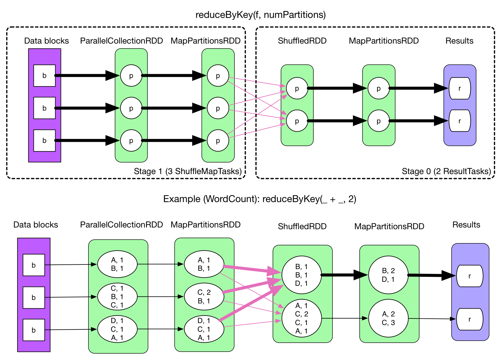
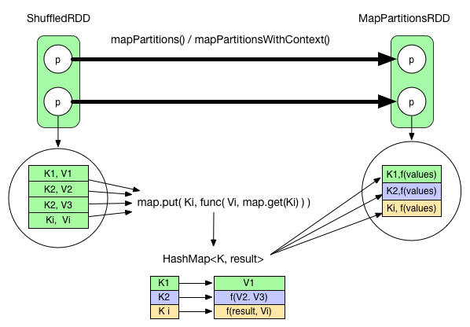
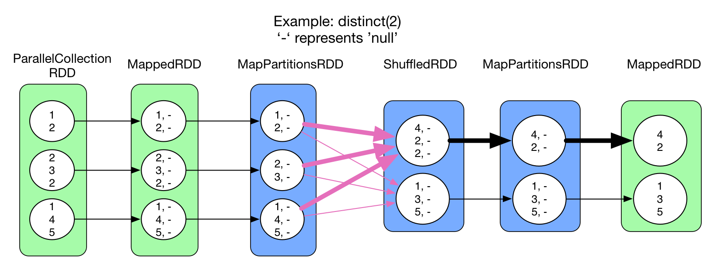
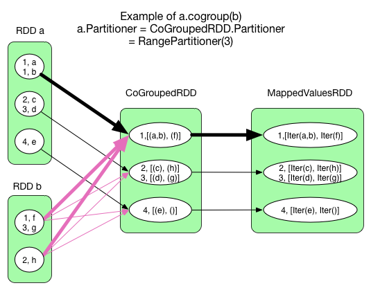
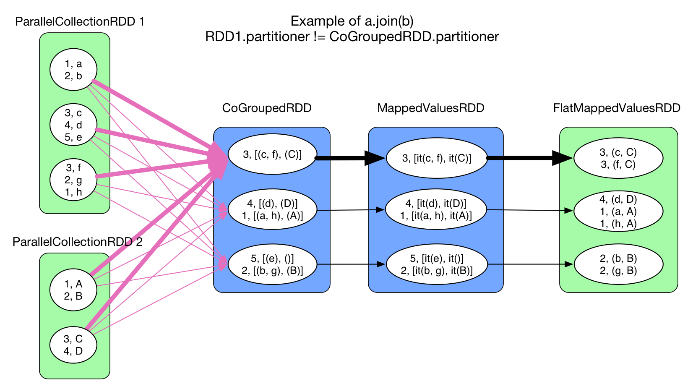

# กระบวนการ Shuffle

ก่อนหน้านี้เราได้พูดคุยถึง Physical plan และการประมวลผลของ Spark ในรายละเอียดมาแล้วแต่มีอย่างหนึ่งที่เรายังไม่ได้แตะเลยก็คือ **ข้อมูลผ่าน `ShuffleDependency` เพื่อไป Stage อื่นได้อย่างไร**

## เปรียบเทียบ Shuffle ระหว่าง Hadoop and Spark
มีทั้งข้อที่เหมือนกันและแตกต่างกันในกระบวนการ Shuffle ของซอฟต์แวร์ทั้งสองตัวนี้คือ Hadoop และ Spark

**จากมุมมองระดับสูงแล้วทั้งสองเหมือนกัน** ทั้งคู่มีการพาร์ทิชัน Mapper เอาท์พุท (หรือ `ShuffleMapTask` ใน Spark) และส่งแต่ละพาร์ทิชันที่ตรงตาม Reducer ของมันไปให้ (ใน Spark มันสามารถเป็น `ShuffleMapTask` ใน Stage ถัดไปหรือเป็น `ResultTask`) ตัว Reducer จะบัฟเฟอร์ข้อมูลไว้ในหน่วยความจำ, Shuffle และรวบรวมข้อมูล แล้วนำไปทำฟังก์ชัน `reduce()` ครั้งหนึ่งเมื่อข้อมูลถูกรวบรวมแล้ว

**จากมุมมองระดับต่ำมีความแตกต่างกันค่อนข้างน้อย** การ Shuffle ใน Hadoop เป็นลักษณะเรียงตามลำดับหรือ Sort-based เนื่องจากเรคอร์ดมีความจำเป็นที่จะต้องถูกเรียงลำดับก่อนที่จะทำงานฟังก์ชัน `combine()` และ `reduce()` การเรียงลำดับสามารถทำได้โดยการใช้ขั้นตอนวิธีจากภายนอก กังนั้นจึงทำให้ `combine()` และ `reduce()` สามารถจัดการกับปัญหาที่มีเซ็ตข้อมูลขนาดใหญ่มากได้ ในขณะนี้ Spark กำหนดค่าเริ่มต้นของกระบวนการ Shuffle เป็นแบบใช้ค่า Hash หรือ Hash-based ซึ่งปกติก็จะใช้  `HashMap` ในการรวบรวมและ Shuffle ข้อมูลและจะไม่มีการเรียงลำดับ แต่ถ้าหากผู้ใช้จ้องการเรียงลำดับก็สามารถเรียกใช้ฟังก์ชัน `sortByKey()` เอาเองได้ ใน Spark 1.1 เราสามารถกำหนดการตั้งค่าได้ผ่าน `spark.shuffle.manager` แล้วตั้งค่าเป็น `sort` เพื่อเปิดใช้การเรียงตามลำดับในกระบวนการ Shuffle แต่ใน Spark 1.2 ค่าเริ่มต้นของกระบวนการ Shuffle กำหนดเป็น Sort-based

**การนำไปใช้อย่างฉลาดมีความแตกต่างกัน** อย่างที่เรารู้กันว่ากลไกการทำงานแต่ละขึ้นตอนของ Hadoop นั้นชัดเจน เรามีการไหลของงาน: `map()`, `spill`, `merge`, `shuffle`, `sort` และ `reduce()` แต่ละขั้นตอนของการรับผิดชอบได้ถูกกำหนดไว้ล่วงหน้าแล้วและมันก็เหมาะสมกับการโปรแกรมแบบเป็นลำดับ อย่างไรก็ดีใน Spark มันไม่ได้มีการกำหนดกลไกที่ชัดเจนและคงที่ไว้ แทนที่จะทำแบบเดียวกับ Hadoop ตัว Spark มี Stage และซีรีย์ของการแปลงข้อมูล ดังนั้นการดำเนินการเช่น `spill`, `merge` และ `aggregate` จำเป็นที่จะต้องรวมอยู่ในกลไกการแปลง (Transformations)

ถ้าเราตั้งชื่อกระบวนการทางฝั่ง Mapper ของการพาร์ทิชันและเก็บข้อมูลว่า `Shuffle write` และฝั่ง Reducer ที่อ่านข้อมูลและรวบรวมข้อมูลว่า `Shuffle read` ปัญหาที่จะตามมาก็คือ **ทำอย่างไรเราถึงจะรวมลอจิกของ Shuffle write และ Shuffle read ใน Logical หรือ Physical ของ Spark? ทำอย่างไรถึงจะทำให้ Shuffle write และ Shuffle read มีประสิทธิภาพ**

## Shuffle Write

Shuffle write เป็น Task ที่ค่อนข้างง่ายถ้าไม่ต้องเรียงเอาท์พุทตามลำดับก่อนมันจะแบ่งพาร์ทิชันข้อมูลแล้ว Persist ข้อมูลไว้ได้เลย การ Persist ข้อมูลมีข้อดีอยู่ 2 อย่างคือลดความดันของ Heap (ผู้แปล: ลดการที่ข้อมูลปริมาณมากถูกเก็บไว้ที่หน่วยความจำแบบ Heap) และส่งเสริมกะบวนการทนต่อความล้มเหลวหรือ Fault-tolerance

กระบวนกานำไปใช้ก็ง่ายมาก: เพิ่มลอจิกของ Shuffle write ไปที่ท้ายสุดของกระบวนการ `ShuffleMapStage` (ในกรณีที่เป็น `ShuffleMapTask`) แต่ละเอาท์พุทของเรคอร์ดใน RDD ตัวสุดท้ายในแต่ละ Stage จะแบ่งพาร์ทิชันและ Persist ข้อมูลดังที่แสดงในแผนภาพนี้


จากแผนภาพจะพบว่ามี 4 `ShuffleMapTask` ที่จะถูกประมวลผลในเครื่อง Worker เครื่องเดียวซึ่งมี 2 Core ผลลัพธ์ของ Task (เรคอร์ดของ RDD ตัวสุดท้ายใน Stage) จะถูกเขียนลงดิสก์ (เราจะเรียกขั้นตอนนี้ว่า Persist ข้อมูล) แต่ละ Task จะมีบัฟฟเฟอร์ `R` ซึ่งจะมีขนาดเท่ากับจำนวนของ Reducer (จำนวนของ Task ที่จะอยู่ใน Stage ถัดไป) บัฟเฟอร์ใน Spark จะถูกเรียกว่า Bucket ขนาด 32KB (100KB ใน Spark 1.1) และสามารถตั้งค่าได้ผ่านตัวตัวตั้งค่า `spark.shuffle.file.buffer.kb`

> ในความเป็นจริงแล้ว Bucket เป็นแนวคิดที่ Spark ใช้แสดงแทนตำแหน่งและพาร์ทิชันของเอาท์พุทของกระบวนการ `ShuffleMapTask` ในส่วนนี้มันง่ายมากถ้า Bucker จะอ้างถึงบัฟเฟอร์ในหน่วยความจำ

`ShuffleMapTask` ใช้กลไกของเทคนิคการ Pipeline เพื่อประมวลผลผลลัพธ์ของเรคอร์ดใน RDD ตัวสุดท้าย แต่ละเรคอร์ดจะถูกส่งไปยัง Bucket ที่รับผิดชอบพาร์ทิชันของมันโดยตรง ซึ่งสามารถกำหนดได้โดย `partitioner.partition(record.getKey())` เนื้อหาที่อยู่ใน Bucket จะถูกเขียนลงไฟล์บนดิสก์อย่างต่อเนื่องซึ่งไฟล์เหล่านี้จะเรียนว่า `ShuffleBlockFile` หรือย่อๆว่า `FileSegment` พวก Reducer จะดึงข้อมูลจาก `FileSegment` เหล่านี้ในช่วงของ Shuffle read

การนำไปใช้งานแบบที่กล่าวมานั้นง่ายมากแต่ก็พบปัญหาบางอย่างเช่น:

1. **เราจำเป็นต้องสร้าง `FileSegment` ออกมามากมาย** แต่ละ `ShuffleMapTask` จะสร้าง `R` (จำนวนเท่ากับ Reducer) `FileSegment`, ดังนั้น `M` `ShuffleMapTask` จะให้ `M*R` ไฟล์ สำหรับเซ็ตข้อมูลขนาดใหญ่เราอาจจะได้ `M` และ `R` ขนาดใหญ่ด้วยทำให้ไฟล์ข้อมูลระหว่างทางหรือ Intermediate นั้นมีจำนวนมหาศาล
2. **บัฟเฟอร์อาจจะใช้พื้นที่มหาศาล** บนโหนด Worker เราสามารถมี `M * R` Bucket สำหรับแต่ละ Core ที่ Spark สามารถใช้งานได้. Spark จะใช้พื้นที่ของบัฟเฟอร์เหล่านั้นซ้ำหลังจากการ `ShuffleMapTask` แต่ทว่ายังต้องคง `R * Core` Bucket ไว้ในหน่วยความจำ ถ้าโหนดมั CPU 8 Core กำลังประมวลผล 1000-reducer Job อยู่ Bucket จะใช้หน่วยความจำสูงถึง 256MB (`R * core * 32KB`)

ในปัจจุบันนี้เรายังไม่มีวิธีการที่เหมาะสมในการจัดการกับปัญหาที่สอง ซึ่งเราจำเป็นต้องเขียนบัฟเฟอร์อยู่และถ้ามันมีขนาดเล็กมากจะส่งผลกระทบกับความเร็วของ IO ของระบบ แต่สำหรับปัญหาแรกนั้นเราสามารถแก้ไขได้ด้วยการรวบรวมไฟล์ซึ่งถูกนำไปใช้ใน Spark แล้ว หากสนใจสามารถดูรายละเอียดได้ดังแผนภาพ


จากแผนภาพด้ายบนจะเห็นได้อย่างชัดเจนว่า `ShuffleMapTask` ที่ตามติดกันมาและทำงานอยู่บน Core เดียวกันสามารถใช้ไฟล์ Shuffle ร่วมกันได้ แต่ละ Task จะเขียนข้อมูลเอาท์พุทต่อจากเดิม `ShuffleBlock` i' จะต่อหลังจากเอาท์พุทของ Task ก่อนหน้าคือ `ShuffleBlock` i (ทีแรกเกิด i ตอนหลังเพิ่ม i' เข้ามาตรงส่วนท้าย) ตัว `ShuffleBlock` จะเรียกว่า `FileSegment` ในการทำแบบนี้ Reducer ใน Stage ถัดไปสามารถดึงไฟล์ทั้งไฟล์ได้แล้วทำให้เราสามารถลดจำนวนไฟล์ที่โหนด Worker ต้องการให้เหลือ `Core * R` ได้ การรวมไฟล์นี้ถูกกำหนดค่าด้วยการตั้งค่า `spark.shuffle.consolidateFiles` ให้มีค่าความจริงเป็น True


## Shuffle Read
เราจะเริ่มกันที่การตรวจสอบ Physical plan ของ `reduceBykey` ซึ่งมี `ShuffleDependency`:


อย่างที่สังหรณ์ใจเราจำเป็นที่จะต้องดึงข้อมูลของ `MapPartitionRDD` เพื่อที่จะสามารถรู้ค่าของ `ShuffleRDD` น้มาซึ่งปัญหา:

- มันจะดึงเมื่อไหร่? จะดึงทุกครั้งที่มีการ `ShuffleMapTask` ดึงครั้งเดียวเมื่อ `ShuffleMapTask`  ทุกตัวเสร็จแล้ว?
- การดึงและกระบวนการของเรคอร์ดเกิดขึ้นในเวลาเดียวกันหรือว่าดึงก่อนแล้วค่อยเข้ากระบวนการ?
- ดึงมาแล้วจะเก็บไว้ที่ไหน?
- ทำอย่างไร Task ที่อยู่ใน Stage ถัดไปถึงจะรู้ว่าตำแหน่งของข้อมูลที่ดึงมาอยู่ตรงไหน?


ทางออกที่ Spark ใช้:

- **เมื่อไหร่ถึงจะดึงข้อมูล?** หลังจากที่ทุก `ShuffleMapTask` เสร็จแล้วถึงจะดึง อย่างที่เราทราบกันดีว่า Stage จะประมวลผลก็กต่อเมื่อ Stage พ่อแม่ของมันประมวลผลเสร็จแล้วเท่านั้น ดังนั้นมันจะเริ่มดึงข้อมูลก็ต่อเมื่อ `ShuffleMapTask` ใน Stage ก่อนหน้าทำงานเสร็จแล้ว ส่วน `FileSegment` ที่ดึงมาแล้วก้จะถูกบัฟเฟอร์ไว้หน่วยความจำ ดังนั้นเราจึงไม่สามารถดึงข้อมูลได้มากจนกว่าเนื้อหาในบัฟเฟอร์จะถูกเขียนลงบนดิสก์ Spark จะลิมิตขนาดของบัฟเฟอร์โดยใช้ `spark.reducer.maxMbInFlight` ซึ่งเราจะเรียกตัวนี้ว่า `softBuffer` ซึ่งขนาดของบัฟเฟอร์มีค่าเริ่มต้นเป็น 48MB และ `softBuffer` มักจะประกอบด้วยการดึงหลาย `FileSegment` แต่ในบางครั้งแค่ Segment เดียวก็เต็มบัฟเฟอร์แล้ว

- **การดึงและกระบวนการของเรคอร์ดเกิดขึ้นในเวลาเดียวกันหรือว่าดึงก่อนแล้วค่อยเข้ากระบวนการ** การดึงและกระบวนการประมวลผลเรคอร์ดเกิดขึ้นในเวลาเดียวกัน ใน MapReduce ขั้นตอนที่ Stage เป็น Shuffle จะดึงข้อมูลและนำลอจิก `combine()` ไปทำกับเรคอร์ดในเวลาเดียวกัน อย่างไรก็ดีใน MapReduce ข้อมูลอินพุทของ Reducer นั้นต้องการเรียงตามลำดับดังนั้น `reduce()` จึงต้องทำงานหลังจากที่มีกระบวนการ Shuffle-sort แล้ว แต่่เนื่องจาก Soark ไม่ต้องการการเรียงตามลำดับก่อนถึงจะให้เป็นข้อมูลอินพุทของ Reducer จึงไม่จำเป็นต้องรอให้ได้รับข้อมูลทั้งหมดก่อนถึงจะเริ่มดำเนินการ **แล้วใน Spark เราใช้งาน Shuffle และกระบวนการได้อย่างไร** ในความเป็นจรงแล้ว Spark จะใช้ประโยชน์จากโครงสร้างข้อมูลเช่น HashMap เพื่อทำ Job นั้นๆ แต่ละคู่ \<Key, Value\> จากกระบวนการ Shuffle จะถูกแทรกเข้าไปใน HashMap ถ้า Key มีอยู่แล้วใน Collection จะเอา Value มารวมกัน โดยจะรวมกันผ่านการใช้ฟังก์ชัน `func(hashMap.get(Key), Value)` ในตัวอย่างโปรแกรม `WordCount` จากแผนภาพด้านบน `func` จะเป็น `hashMap.get(Key) + Value` และผลลัพธ์ของมันจะกลับไปอัพเดทใน HashMap ตัว `func` นี่เองที่ทำหน้าที่เหมือนกับ `reduce()` ใน Hadoop แต่พวกมันก็มีข้อแตกต่างกันในรายละเอียด ซึ่งจะแสดงในโค้ดดังนี้

	```java
	// MapReduce
	reduce(K key, Iterable<V> values) {
		result = process(key, values)
		return result
	}

	// Spark
	reduce(K key, Iterable<V> values) {
		result = null
		for (V value : values)
			result  = func(result, value)
		return result
	}
	```
	
ใน Hadoop MapReduce เราสามารถกำหนดโครงสร้างข้อมูลใดๆตามที่เราต้องการได้ในฟังก์ชัน `process` ซึ่งมันเป็นแค่ฟังก์ชันที่รับ `Iterable` เป็นพารามิเตอร์ เราสามารถที่จะเลือกแคช `values` สำหรับใช้ประมวลผลต่อไปในอนาคตได้ และใน Spark มีเทคนิคคล้าย `foldLeft` ที่ถูกใช่กับ `func` เช่นใน Hadoop มันสามารถหาค่าเฉลี่ยได้ง่ายมากจากสมการ `sum(values) / values.length` แต่ไม่ใช่กับ Spark เราจะมาพูดถึงเรื่องนี้กันอีกครั้งภายหลัง

- **ดึงมาแล้วจะเก็บไว้ที่ไหน?** `FileSegment` ที่ดึงมาแล้วจะถูกบัฟเฟอร์ไว้ใน `softBuffer` หลังจากนั้นข้อมูลจะถูกประมวลผลและเขียนลงไปในตำแหน่งที่ได้กำหนดการตั้งค่าไว้แล้ว ถ้า `spark.shuffle.spill`  เป็น False แล้วตำแหน่งที่จะเขียนเก็บไว้จะอยู่ในหน่วยความจำเท่านั้น โครงสร้างข้อมูลแบบพิเศษคือ `AppendOnlyMap` จะถูกใช้เก็บข้อมูลของกระบวนการนี้เอาไว้ในหน่วยความจำ ไม่งั้นมันจะเขียนข้อมูลของกระบวนการลงทั้งในดิสก์และหน่วยความจำโดยใช้ `ExternalAppendOnlyMap` โครงสร้างข้อมูลนี้สามารถล้นออกไปเรียง Key/Value ตามลำดับบนดิสก์ได้ในกรณีที่หน่วยความจำมีที่ว่างไม่พอ **ปัญหาสำคัญคือเมื่อเราใช้ทั้งหน่วยความจำและดิสก์ทำอย่างไรเราถึงจะทำให้มันสมดุลกันได้** ใน Hadoop จะกำหนดค่าเริ่มต้น 70% ของหน่วยความจำจะถูกจองไว้สำหรับใช้กับข้อมูล Shuffle เมื่อ 66% ของพื้นที่หน่วยความจำส่วนนี้ถูกใช้ไปแล้ว Hadoop จะเริ่มกระบวนการ Merge-combine-spill ในส่วนของ Spark จะมีกลยุทธ์ที่คล้ายๆกันซึ่งเราก็จะคุยเรื่องนี่้ในบทถัดไป
- **ทำอย่างไร Task ที่อยู่ใน Stage ถัดไปถึงจะรู้ว่าตำแหน่งของข้อมูลที่ดึงมาอยู่ตรงไหน?** นึกย้อนกลับไปถึงบทล่าสุดที่เราผ่านมาซึ่งมีขั้นตอนที่สำคัญมากคือ`ShuffleMapStage` ซึ่งจะลงทะเบียน RDD ตัวสุดท้ายโดยการเรียกใช้ `MapOutputTrackerMaster.registerShuffle(shuffleId, rdd.partitions.size)` ดังนั้นระหว่างกระบวนการ Shuffle นี้ Reducer จะได้รับตำแหน่งของข้อมูลโดนเรียกถาม `MapOutputTrackerMaster` ในโปรแกรมไดรว์เวอร์ และเมื่อ `ShuffleMapTask` ดำเนินการเรียบร้อยแล้วมันจะรายงานตำแหน่งของไฟล์ที่เป็น `FileSegment` ไปยัง `MapOutputTrackerMaster`

ตอนนี้เราจะมาถกเถียงกันในประเด็นหลักของไอเดียที่ซ่อนอยู่เบื้องหลังการทำงานของ Shuffle write และ Shuffle read รวมถึงการนำไปใช้งานในบางรายละเอียด

## Shuffle Read of Typical Transformations

### `reduceByKey(func)`

เราเคยคุยกันคร่าวๆแล้วเกี่ยวกับกระบวนการดึงและ Reduce ของ `reduceByKey()` แต่โปรดทราบว่าสำหรับ RDD ใดๆแล้วไม่จำเป็นว่าทั้งหมดของข้อมูลจะต้องอยู่บนหน่วยความจำในตอนที่เรากำหนดค่า การประมวลผลจะทำบนเรคอร์ดเป็นหลัก เรคอร์ดที่ประมวลผลเสร็จแล้วจะถูกปฏิเสธถ้าเป็นไปได้ ในมุมมองจากระดับของเรคอร์ด `reduce()` จะถูกแสดงไว้ดังแผนภาพด้านล่าง:



เราจะเห็นว่าเรคอร์ดที่ถูกดึงมาได้รวมกันโดยใช้ HashMap และเมื่อทุกเรคอร์ดถูกรวมเข้าด้วยกันครั้งหนึ่งแล้วเราจะได้ผลลัพธ์ออกมา ตัว `func` ต้องการสับเปลี่ยน


การดำเนินการ `mapPartitionsWithContext` ใช้สำหรับการแปลงจาก `ShuffleRDD` ไปเป็น `MapPartitionRDD`

เพื่อลดภาระของการจราขรบนเครือข่ายระหว่างโหนด เราสามารถใช้ `combine()` ในฝั่ง Map ได้ใน Hadoop ในส่วนของ Spark มันก็สะดวกสบายเช่นกัน ทั้งหมดที่เราต้องทำคือนำ `mapPartitionsWithContext` ไปใช้กับ `ShuffleMapStage` เช่น ใน `reduceByKey` การแปลงจาก `ParallelCollectionRDD` ไป `MapPartitionsRDD` มีค่าเทียบเท่ากับการ Combine ในฝั่ง Map

**ข้อเปรียบเทียบระหว่าง map()->reduce() ใน Hadoop และ `reduceByKey` ใน Spark**
- ฝั่ง Map : ในส่วนนี้จะไม่มีความแตกต่างกัน สำหรับลอจิก `combine()` Hadoop ต้องการเรียงตามลำดับก่อนที่จั `combine()`. Spark ใช้ `conbine()` ในรูปแบบของการใช้ Hash map
- ฝั่ง Reduce : กระบวนการ Shuffle ใน Hadoop จะดึงข้อมูลจนกระทั่งถึงจำนวนหนึ่งจากนั้นจะทำ `combine()` แล้วจะรวมการเรียงลำดับของข้อมูลเพื่อป้อนให้ฟังก์ชัน `reduce()` ใน Spark การดึงข้อมูลและ Reduce เกิดขึ้นในเวลาเดียวกัน (ใน Hash map) ดังนั้นฟังก์ชัน Reduce จะต้องการการสับเปลี่ยน

**ข้อเปรียบเทียบในแง่ของการใช้งานหน่วยความจำ**
- ฝั่ง Map : Hadoop ต้องใช้บัฟเฟอร์แบบวงกลมเพื่อถือและเรียงลำดับของข้อมูลเอาท์พุทจาก `map()` แต่ส่วนของ `combine()` ไม่ต้องการพื้นที่หน่วยความจำเพิ่มเติม Spark ต้องการใช้ Hash map เพื่อทำ `combine()` และการเก็บข้อมูลเรอคอร์ดเหล่านั้นลงดิสก์ต้องการใช้บัฟเฟอร์ (Bucket)
- ฝั่ง Reduce: Hadoop ต้องใช้เนื้อที่ของหน่วยความจำบางส่วนเพื่อนที่จะเก็บข้อมูลที่ Shuffle แล้วเอาไว้. `combine()` และ `reduce()` ไม่จำเป็นต้องใช้เนื้อที่ของหน่วยความจำเพิ่มเติมเนื่องจากอินพุทเหล่านี้ถูกเรียงตามลำดับไว้เรียบร้อยแล้วดังนั้นจึงสามารถจะจัดกลุ่มและรวบรวมได้เลย ใน Spark `softBuffer` จำเป็นกับการดึงข้อมูล และ Hash map ถูกใช้สำหรับเก็บข้อมูลผลลัพธ์ของการ `combine()` และ `reduce()` เอาไว้ถ้ามีแค่การใช้งานหน่วยความจำในกระบวนการประมวลผลข้อมูล อย่างไรก็ตามส่วนของข้อมูลสามารถเก็บบนดิสก์ได้ถ้ามีการตั้งค่าไว้เป็นแบบใช้งานทั้งหน่วยความจำและดิสก์

### `groupByKey(numPartitions)`


กระบวนการที่คล้ายกันกับ `reduceByKey()` ตัว `func` จะเป็น `result = result ++ result.value` นั่นคือแต่ละ Key จะจัดกลุ่มของ Value รวมเอาไว้ด้วยกันโดยไม่มีการรวบรวมกันอีกภายหลัง

### `distinct(numPartitions)`




คล้ายกับการทำงานของ `reduceByKey()` ตัว `func` คือ `result = result == null ? record.value : result` นั่นหมายความว่าจะตรวจสอบดูเรคอร์ดใน `HashMap` ก่อนว่ามีหรือเปล่า ถ้ามีอยู่แล้วก็จะปฏิเสธเรคอร์ดนั้น ถ้ายังไม่มีอยู่ก็จะเพิ่มเข้าไปใน Map. ซึ่งฝั่งที่ทำการ Map จะทำงานเหมือนกับ `reduceByKey()` คือมีการ `combine()` ที่ฝั่ง Map นั่นเอง

### `cogroup(otherRDD, numPartitions)`



สามารถเป็นได้ทั้ง 0, 1 หรือหลาย `ShuffleDependency` สำหรับส่วนของ `CoGroupedRDD` แต่ในกระบวนการ Shuffle เราไม้ได้สร้าง Hash map สำหรับ Shuffle dependency แต่ละตัวแต่จะใช่ Hash map แค่ตัวเดียวกับ Shuffle dependency ทุกตัว ซึ่งแตกต่างการ `reduceByKey` ที่ Hash map จำถูกสร้างในเมธอต `compute()` ของ RDD มากกว่า `mapPartitionWithContext()`

Task ของการประมวลผลของ RDD จะจัดสรรให้มี `Array[ArrayBuffer]` ซึ่ง Array ตัวนี้จะมีจำนวนของ `ArrayBuffer` ที่ว่างเปล่าเท่ากับจำนวนของ RDD อินพุท ยกตัวอย่างของแผนภาพด้านบนเรามี `ArrayBffer` อยู่ 2 ตัวในแต่ละ Task ซึ่งเท่ากับจำนวน RDD อินพุทที่เข้ามา เมื่อคู่ Key/Value มาจาก `RDD a` มันจะเพิ่มเข้าไปใน `ArrayBuffer` ตัวแรกถ้าคู่ Key/Value มาจาก `RDD b` มันจะเพิ่มเข้าไปใน `ArrayBuffer` ตัวที่สองจากนั้นจะเรียก `mapValues()` ให้ทำการแปลงจาก Values .ห้เป็นชนิดที่ถูกต้อง: `(ArrayBuffer, ArrayBuffer)` => `(Iterable[V], Iterable[W])`.

### `intersection(otherRDD)` and `join(otherRDD, numPartitions)`




การดำเนินการของสองตัวนี้ใช้ `cogroup` ดังนั้นแล้วกระบวนการ Shuffle มันก็จะเป็นแบบ `cogroup` ด้วย

### sortByKey(ascending, numPartition)


กระบวนการประมวลผลลิจิกของ `sortByKey()` แตกต่างกับ `reduceByKey()` เพียงเล็กน้อยคือตัวนี้มันไม่ได้ใช้ `HashMap` เพื่อจัดการกับเรคอร์ดข้อมูลที่ถูกดึงมา แต่ทุกคู่ Key/Value จะเป็นพาร์ทิชันแบบ Range partition เรคอร์ดที่อยู่ในพาร์ทิชันเดียวกันจะอยู่ในลักษณะเรียงลำดับตาม Key เรียบร้อยแล้ว
The processing logic of `sortByKey()` is a little different from `reduceByKey()` as it does not use a `HashMap` to handle incoming fetched records. Instead, all key-value pairs are range partitioned. The records of the same partition is sorted by key.

### `coalesce(numPartitions, shuffle = true)`


`coalesce()` จะสร้าง `ShuffleDependency` ก็จริงแต่ว่ามันไม่ได้จำเป็นว่าเราจะต้องรวมเรคอร์ดที่ดึงมาไว้ด้วยกันดังนั้น Hash map ก็ไม่มีความจำเป็น

## HashMap ใน Shuffle Read

ดังที่เราได้เห็นมาว่า Hash map เป็นโครงสร้างข้อมูลที่มีการใช้บ่อยในกระบวนการ Shuffle ของ Spark ซึ่งตัว Spark เองก็มี Hash map อยู่ 2 เวอร์ชั่นที่มีลักษณะเฉพาะ: `AppendOnlyMap` เป็น Hash map ที่อยู่ในหน่วยความจำ และอีกเวอร์ชันเป็นเวอร์ชันที่อยู่ได้ทั้งในหน่วยความจำและดิสก์คือ `ExternalAppendOnlyMap` เดี๋ยเราจะมาดูว่าทั้งสอง Hash map นี้มีความแตกต่างกันยังไง

### `AppendOnlyMap`

ในเอกสารของ Spark อธิบายว่า `AppendOnlyMap` เป็น "ตาราง Hash แบบเปิดง่ายๆที่ถูกปรับแต่งให้มีลักษณะเพิ่มเข้าไปได้เท่านั้น, Key ไม่สามารถถูกลบออกได้แต่ Value ของแต่ละ Key สามารถเปลี่ยนแปลงได้" วิธีการนำไปใช้ของมันก็ง่ายมาก: จัดสรร Array ของ `Object` ขนาดใหญ่ หากดูตามแผนภาพด้านล่างจะเห็นว่า Key จะถูกเก็บอยู่ในส่วนสีน้ำเงินและ Value จะถูกเก็บในส่วนสีขาว


เมื่อมีการ `put(K,V)` เกิดขึ้นเราจะหาช่องของ Array ได้โดย `hash(K)` **ถ้าตำแหน่งช่องที่ได้มามีข้อมูลอยู่แล้วจะใช้วิธี Quandratic probing เพื่อหาช่องวางไหม่** (ดูคำอธิบายในย่อหน้าถัดไป) ยกตัวอย่างในแผนภาพด้านบน `K6` การ Probing ครั้งที่สามจึงจะพบช่อองว่างซึ่งเป็นช่องที่หลังจาก `K4` จากนั้น Value จะถูกแทรกเพิ่มหลังจากที่ Key แทรกเข้าไปแล้ว เมื่อ `get(K6)` เราก็จะใช้เทคนิคเดียวกันนี้เข้าถึงแล้วดึง `V6` ซึ่งเป็น Value ในช่องถัดจาก Key ออกมาจากนั้นคำนวณค่า Value ใหม่แล้วก็เขียนกลับไปในตำแหน่งเดิมของ `V6`

`(Quandratic probing เป็นวิธีการหาช่องว่างของตาราง Hash ในกรณีที่ไม่สามารถหาช่องว่างจาก hash(K) โดยตรงได้จะเอา hash(K) บวกเลขกำลังสองของจำนวนครั้งที่เกิดซ้ำ เช่น hash(K) + 1*1 ยังไม่ว่างก็ไปหา hash(K) + 2*2 ถ้ายังไม่ว่างอีก hash(K) + 3*3`

การวนซ้ำบน `AppendOnlyMap` จะเป็นแค่การแสกน Array

ถ้า 70% ของ Array ถูกจัดสรรให้ใช้ไปแล้วมันจะมีการขยายเพิ่มเป็น 2 เท่าทำให้ Key จะถูกคำนวณ Hash ใหม่และตำแหน่งก็จะเปลี่ยนแปลงไป

`AppendOnlyMap` มีเมธอต `destructiveSortedIterator(): Iterator[(K, V)]` ซึ่งคืนค่าคู่ Key/Value ที่เรียงตามลำดับแล้ว ในขั้นตอนการทำงานของมันจะเริ่มจากการที่กระชับคู่ Key/Value ไปให้อยู่ในลักษณะ Array ที่ค่าคู่ Key/Value อยู่ในช่องเดียวกัน (แผนภาพด้านบนมันอยู่คนละช่อง) แล้วจากนั้นใช้ `Array.sort()` ซึ่งเป็นการเรียกให้เกิดการเรียงตามลำดับของข้อมูลใน Array แต่การดำเนินการนี้จะทำลายโครงสร้างของข้อมูล

### `ExternalAppendOnlyMap`


หากจะเปรียบเทียบกับ `AppendOnlyMap` การนำ `ExternalAppendOnlyMap` ไปใช้ดูจะซับซ้อนกว่า เพราะมันมีแนวคิดคล้ายๆกับกระบวนการ `shuffle-merge-combine-sort` ใน Hadoop

`ExternalAppendOnlyMap` จะใช้ `AppendOnlyMap` คู่ Key/Value ที่เข้ามาจะถูกเพิ่มเข้าไปใน `AppendOnlyMap` **เมื่อ `AppendOnlyMap` มีขนาดเกือบเท่าของตัวมันเราจะตรวจสอบว่ามีเนื้อที่ว่างบนหน่วยความจำเหลืออยู่ไหม? ถ้ายังเหลือ `AppendOnlyMap` ก็จะเพิ่มขนาดเป็นสองเท่า ถ้าไม่พอมันจะเอาคู่ Key/Value ทั้งหมดของตัวมันไปเรียงตามลำดับจากนั้นก็จะเอาไปเขียนบนดิสก์ โดยใช้ `destructiveSortedIterator()` ** ในแผนภาพจะเห็นว่า Map มีการล้นหรือ Spill อยู่ 4 ครั้งซึ่งแต่ละครั้งที่ Spill แต่ละครั้งก็จะมีไฟล์ของ `spillMap` เกิดขึ้นมาใหม่ทุกครั้งและตัว `AppendOnlyMap` จะถูกสร้างขึ้นมาเพื่อรอรับคู่ Key/Value. ใน `ExternalAppendOnlyMap` เมื่อคู่ Key/Value ถูกใส่เพิ่มเข้ามาแล้วมันจะเกิดการรวมกรเฉพาะส่วนที่อยู่บนหน่วยความจำ (`AppendOnlyMap`) ดังนั้นหมายความว่าถ้าเราอยากได้ผลลัพธ์สุดท้าย Global merge-aggregate จะถูกเรียกใช้บนทุกๆ Spill และ `AppendOnlyMap` ในหน่วยความจำ

**Global merge-aggregate ทำงานดังต่อไปนี้** เริ่มแรกส่วนที่อยู่ในหน่วยความจำ (`AppendOnlyMap`) จะถูกเรียงตามลำดับเป็น `sortedMap` จากนั้น `DestructiveSortedIterator` (สำหรับ `sortedMap`) หรือ `DiskMapIterator` (สำหรับ `spillMap` ที่อยู่บนดิสก์) จะถูกใช้เพื่ออ่านส่วนของคู่ Key/Value แต่ละส่วนเข้าสู่ `StreamBuffer` จากนั้น `StreamBuffer` จะเพิ่มเข้าไปใน `mergeHeap` ในแต่ละ `StreamBuffer` ทุกเรคอร์ดจะมี `hash(key)` เดียวกัน สมมติว่าในตัวอย่างเรามี `hash(K1) == hash(K2) == hash(K3) < hash(K4) < hash(K5)` เราจะเห็นว่ามี 3 เรคอร์ดแรกของ Map ที่ Spill แรกมี `hash(key)` เดียวกันจึงอ่านเข้าสู่ `StreamBuffer` ตัวเดียวกัน ขั้นตอนการรวมกันของมันกไม่ยาก: เอา `StreamBuffer` ที่มีค่า `hash(key)` จากนั้นก็เก็บเข้าใน `ArrayBuffer[StreamBuffer]` (`mergedBuffer`) สำหรับผลการรวม `StreamBuffer` ตัวแรกที่ถูกเพิ่มเข้าไปเรียกว่า `minBuffer` ซึ่ง Key ของมันจะเรียกว่า `minKey` การรวมหรือ Merge หนึ่งครั้งจะรวบรวมทุกๆคู่ Key/Value ที่มี Key เป็น `minKey` ใน `mergedBuffer` จากนั้นก็ให้ผลลัพธ์ออกมา เมื่อการดำเนินการ Merge ใน `mergedBuffer` เสร็จแล้วคู่ Key/Value ที่เหลืออยู่จะคืนค่ากลับไปยัง `mergeHeap` และทำ `StreamBuffer` ให้ว่าง จากนั้นจะอ่านเข้ามาแทนใหม่จากในหน่วยความจำหรือ Spill ที่อยู่บนดิสก์

ยังมีอีก 3 ประเด็นที่จะต้องพูดคุยกัน:

 - การตรวจสอบหน่วยความจำว่าว่างหรือเปล่านั้นใน Hadoop จะกำหนดไว้ที่ 70% ของหน่วยความจำของ Reducer สำหรับ Shuffle-sort และก็คล้ายๆกันกับใน Spark 0ะตั้งค่า `spark.shuffle.memoryFraction * spark.shuffle.safetyFraction` (ค่าเริ่มต้น 0.3 * 0.8) สำหรับ `ExternalAppendOnlyMap` **ซึ่งดูเหมือนว่า Spark สงวนหน่วยความจำเอาไว้ และยิ่งไปกว่านั้นคือ 24% ของหน่วยความจำจะถูกใช้งานร่วมกันในทุก Reducer ที่อยู่ใน Executor gดียวกัน** ตัว Executor เองก็มีการถือครอง `ShuffleMemoryMap: HashMap[threadId, occupiedMemory]` เอาไว้อยู่เพื่อตรวจสอบการใช้งานหน่วยความจำของ `ExternalAppendOnlyMap` ในแต่ละ Reducer ก่อนที่ `AppendOnlyMap` จะขยายขนาดขึ้นจะต้องตรวจสอบดูก่อนว่าขนาดหลังจากที่ขยายแล้วเป็นเท่าไหร่โดยใช้ข้อมูลจาก `ShuffleMemoryrMap` ซึ่งต้องมีที่ว่างมากพอถึงจะขยายได้ ดังนั้นโปรดทราบว่า 1000 เรเคอร์ดแรกมันจะไม่มีการกระตุ้นให้มีการตรวจสอบ Spill

 - `AppendOnlyMap` เป็นขนาดโดยประมาณ เพราะถ้าหากเราต้องการทราบค่าที่แน่นอนของ `AppendOnlyMap` เราก็ต้องคำนวณหาขนาดในทุกๆตัวที่มีการอ้างถึงในขณะที่มีการขยายตัวไปด้วยแต่มันใช้เวลามาก Spark จึงเลือกใช้วิธีประมาณซึ่งความซับซ้อนของขั้นตอนวิธีเป็น O(1) ในความหลักของมันคืออยากรู้ว่าขนาดของ Map เปลี่ยนไปอย่างไรหลังจากการเพิ่มเข้าและรวบรวมกันของเรคอร์ดจำนวนหนึ่งเพื่อประมาณการขนาดของทั้งโครงสร้าง รายละเอียดอยู่ใน `SizeTrackingAppendOnlyMap` และ `SizeEstimator`
 
 - กระบวนการ Spill จำเหมือนกับ Shuffle write คือ Spark จะสร้างบัฟเฟอร์เมื่อมีการ Spill เรเคอร์ดไปยังดิสก์ ขนาดของมันคือค่าที่ตั้งค่าใน `spark.shuffle.file.buffer.kb` โดยค่าเริ่มต้นคือ 32KB เนื่องจาก Serializer ก็ได้จัดสรรบัฟเฟอร์สำหรับทำ Job ไว้ด้วย ดังนั้นปัญหาก็จะเกิดขึ้นเมื่อเราลอง Spill เรคอร์ดจำนวนมากมหาศาลในเวลาเดียวกัน ทำให้ Spark จำกัดจำนวนเรคอร์ดที่สามารถ Spill ได้ในเวลาเดียวกันนี้ในตัวตั้งค่า `spark.shuffle.spill.batchSize` ซึ่งขนาดเริ่มต้นเป็น 10000 ตัว

## การพูดคุย
อย่างที่เราเห็นในบทนี้คือ Spark มีแนวทางจัดการปัญหาที่ยืดหยุ่นมากในกระบวนการ Shuffle เมื่อเทียบกับที่ Hadoop ใช้คือการ Fix ลงไปว่าต้อง shuffle-combine-merge-reduce ใน Spark เป็นไปได้ที่จะผสมผสานกันระหว่างกลยุทธ์ทีหลากหลายในกระบวนการ Shuffle โดยใช้โครงสร้างข้อมูลที่แตกต่างกันไปเพื่อที่จะให้กระบวนการ Shuffle ที่เหมาะสมบนพื้นฐานของการการแปลงข้อมูล

ดังนั้นเราจึงได้มีการพูดคุยกันถึงกระบวนการ Shuffle ใน Spark ที่ปราศจากการเรียงลำดับพร้อมกับทำอย่างไรกระบวนการนึ้ถึงจะควบรวมกับ Chain การประมวลผลของ RDD จริงๆ อีกทั้งเราคุยกันถึงเรื่องเกี่ยวกับปัญหาของหน่วยความจำและดิสก์ รวมถึงเปรียบเทียบในบางแง่มุมกับ Hadoop ในบทถัดไปเราจะอธิบายถึงกระบวนการการที่ Job ถูกประมวลผลจากแง่มุมของการสื่อสารกันระหว่างโปรเซส Inter-process communication. ปัญหาของตำแหน่งข้อมูลก็ได้กล่าวถึงในบทนี้ด้วยเช่นกัน

So far we've discussed the shuffle process in Spark without sorting as well as how this process gets integrated into the actual execution of the RDD chain. We've also talked about memory and disk issues and compared some details with Hadoop. In the next chapter we'll try to describe job execution from an inter-process communication perspective. The shuffle data location problem will also be mentioned.

เพิ่มเติมในบทนี้คือมีบล๊อคที่น่าสนใจมากๆ (เขียนในภาษาจีน) โดย Jerry Shao, [Deep Dive into Spark's shuffle implementation](http://jerryshao.me/architecture/2014/01/04/spark-shuffle-detail-investigation/).
